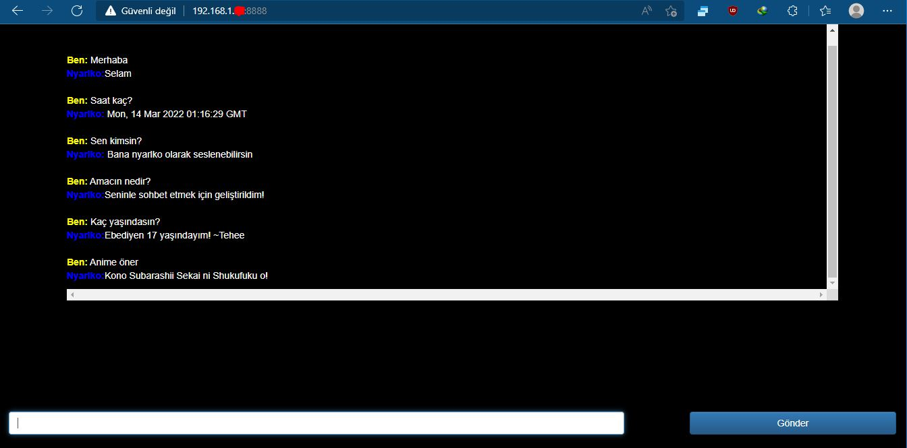
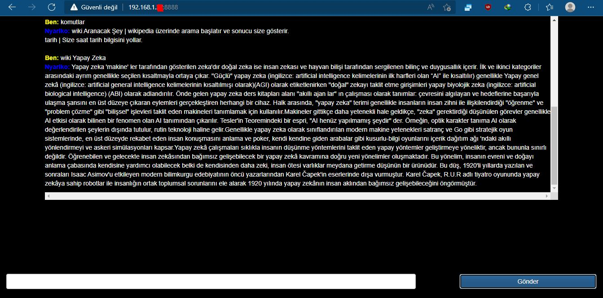
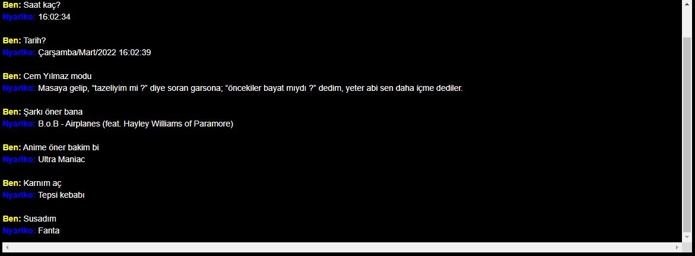

# nyarlko
Nyarlko Türkçe bir chatbotdur. Basit seviyede sizinle sohbet edebilir. Size izleyecek anime önerebilir. Sizin için wikipedia'yı arayabilir.
# Kurulum
  https://developer.nvidia.com/cuda-downloads indirin ve kurun.
  https://developer.nvidia.com/compute/cudnn/secure/8.3.2/local_installers/11.5/cudnn_8.3.2.44_windows.exe İndirin ve kurun.
  https://tr.dll-files.com/cudnn64_8.dll.html indirin ve C:\Program Files\NVIDIA\CUDNN\v8.3\bin içerisine atın.
  * Bilgisayarı yeniden başlatın.
  * build.py dosyasını çalıştırın. (Gereksinimleri otomatik yükleyecek.)
# Değişiklik
  job_intents.json dosyasındaki örnekler gibi daha çok konuşma ekleyerek botu yükseltebilirsiniz.
  Bu dosyayı her düzenledikten sonra botu kapatıp "build.py" dosyasını yeniden çalıştırmanız gerekir.
  16.03.2022:2.39 Müzik, Yemek,İçecek,Tatlı önerisi eklendi.
# Nasıl başlatılır?
  App.py dosyasını açın. Tamamen açılmasını bekleyin.
# Nasıl konuşulur?
  Aynı ağa bağlı bir telefon/tablet/akıllı televizyon'dan 
  * Running on http://192.168.1.2:8888/ yazan ip adresini tarayıcınıza girin.
  * (Sizde bu adres farklı olacak. App.py'yi açınca ekranda yazan adrese girin.) 
# Yenilikler
  * 16.03.2022:2.39 Müzik, Yemek, İçecek, Tatlı önerisi eklendi.
  * 16.03.2022:16.00 Yemekler, Şakalar eklendi. Bazı özellikler processor.py'nin karmaşıklaşmaması için özellik başına dosya olarak yeniden yazıldı.
# Ekran Alıntıları:

  
    
    

